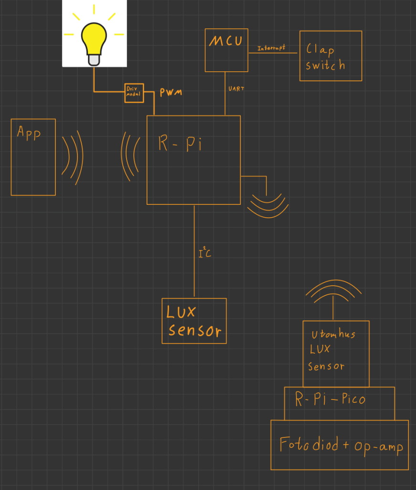
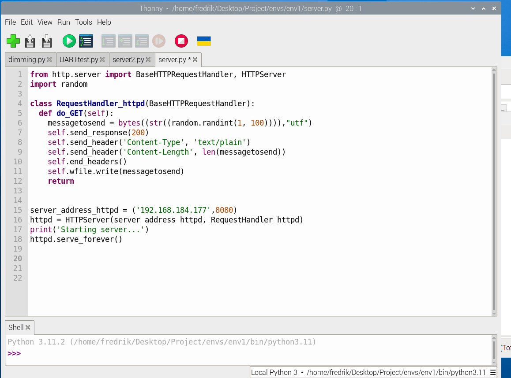

# Smart Lighting Embedded System

Smart lighting system with automatic light regulation using Raspberry Pi, Raspberry Pi Pico, light sensors, PWM and Wi-Fi communication.

## Overview

This project implements a smart lighting system designed to automatically regulate light intensity based on ambient light conditions.

The system combines a Raspberry Pi, Raspberry Pi Pico, light sensors and PWM-based dimming. It also provides manual control through a mobile application.

## System Architecture

The Raspberry Pi acts as a central part of the system and communicates with sensors, the microcontroller and the mobile application.



## Features

- Automatic light intensity regulation
- PWM-based light dimming
- Ambient light measurement
- Raspberry Pi and Raspberry Pi Pico integration
- Wi-Fi communication
- Mobile application control
- UART communication
- I²C communication
- Sensor-based lighting control

## Hardware

The system uses several hardware components for sensing, communication and lighting control:

- Raspberry Pi
- Raspberry Pi Pico
- Microcontroller
- Light sensors
- Photodiode
- Operational amplifier
- Lighting driver
- Light source

## Software & Technologies

The project combines embedded hardware with software and communication technologies:

- Python
- Raspberry Pi
- Raspberry Pi Pico
- PWM
- UART
- I²C
- Wi-Fi
- Embedded systems
- Sensor interfacing

## Mobile Application

A mobile application provides manual control of the lighting system. The interface allows the user to turn the light on or off and change the light intensity.

### Main Control Interface


### Light Intensity Control


## Raspberry Pi Software

Python is used on the Raspberry Pi for communication and control of different parts of the system.

The software includes functionality for:

- PWM control
- UART communication
- Communication with sensors
- Light dimming
- Server functionality
- System testing



## Source Code

The source code is available in the `src` directory.

Main files include:

- `PWM.py` – PWM-based light intensity control
- `dimming.py` – Light dimming functionality
- `UARTtr.py` – UART communication
- `UARTtest.py` – UART communication testing
- `write_read.py` – Data communication and read/write functionality
- `server.py` – Raspberry Pi server functionality
- `server2.py` – Additional server implementation

## System Communication

The project uses several communication methods between the different components.

**Wi-Fi**

Used for communication between the mobile application and the Raspberry Pi.

**UART**

Used for serial communication between system components.

**I²C**

Used for communication with light sensors.

**PWM**

Used to regulate the intensity of the connected light source.

## How the System Works

1. Light sensors measure the ambient light level.
2. Sensor data is processed by the system.
3. The Raspberry Pi determines the required lighting level.
4. PWM is used to regulate the light intensity.
5. The user can manually control the light through the mobile application.
6. Wi-Fi enables communication between the mobile application and the Raspberry Pi.
7. The Raspberry Pi Pico and other embedded components handle sensing and control tasks.

## Project Purpose

The purpose of the project was to develop a smart lighting solution combining embedded systems, sensors, communication protocols and software.

The project demonstrates practical experience with:

- Embedded systems
- Raspberry Pi development
- Microcontroller communication
- Sensor integration
- PWM control
- Python programming
- Wi-Fi communication
- UART and I²C
- Mobile control
- Hardware/software integration

## Repository Structure

```text
smart-lighting-embedded-system/
│
├── src/
│   ├── PWM.py
│   ├── dimming.py
│   ├── UARTtr.py
│   ├── UARTtest.py
│   ├── write_read.py
│   ├── server.py
│   └── server2.py
│
├── images/
│   ├── system-architecture.png.webp
│   ├── mobile-app-control-interface.png
│   ├── mobile-app-dimming-control.png
│   └── raspberry-pi-server-code.png.webp
│
├── .gitignore
└── README.md
```
